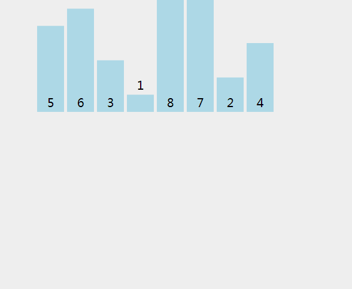

# Merge-Sort
## 归并排序
+ 动图演示
  
+ 归并
  >Sort.java
  ```java
  protected static int[] merge(int[] a) {
        int l = a.length;
        //拆分到最小组
        if (a.length < 2)
            return a;
        //拆分
        int[] left = new int[l/2];
        int[] right = new int[l-l/2];
        //这玩意比copyOfRange好用多了
        System.arraycopy(a, 0, left, 0, l / 2);
        System.arraycopy(a, l / 2, right, 0, l - l / 2);

        //排序
        return sort(merge(left), merge(right));
    }
  ```
+ 排序
  >Sort.java
  ```java
  private static int[] sort(int[] left, int[] right) {
        //索引
        int index = 0, r = 0, l = 0;
        //返回数组
        int[] result = new int[left.length+right.length];

        while (index < result.length) {
            if (r >= right.length) {
                result[index] = left[l++];
            } else if (l >= left.length) {
                result[index] = right[r];
            } else if (left[l] <= right[r]) {
                result[index] = left[l++];
            } else if (right[r] < left[l]) {
                result[index] = right[r++];
            }
            index++;
        }
        return result;
    }
  ```
